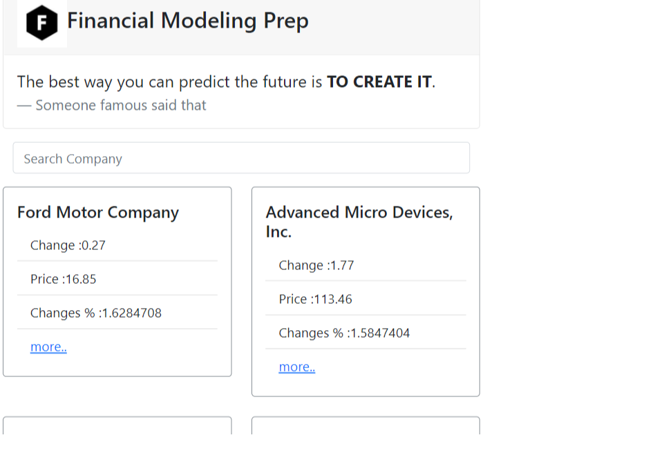

# Stock market application

 

> A mobile web application to check a list of Stock market metrics and making use of React and Redux.

## Built With

- HTML, CSS and JS
- ReactJS library
- Redux

## Live Demos

- [ Live Demo](https://naughty-bell-f7b008.netlify.app/)

## Getting Started

### Install

` git clone git@github.com:ahmedtaa/stock-market.git YOUR_FOLDER_NAME`
` cd YOUR_FOLDER_NAME`
` npm run build`
` npm start`

## Authors

👤 **Author1**

- GitHub: [@ahmedtaa](https://github.com/ahmedta)
- Twitter: [@\_ahmedta](https://twitter.com/_ahmedta)

## 🤝 Contributing

Contributions, issues, and feature requests are welcome!

Feel free to check the [issues page](../../issues/).

## Show your support

Give a ⭐️ if you like this project!

## Acknowledgement

Original design idea by [Nelson Sakwa on Behance..](https://www.behance.net/gallery/31579789/Ballhead-App-%28Free-PSDs%29) Under the [Creative Commons License](https://creativecommons.org/licenses/by-nc/4.0/)

## 📝 License

This project is [MIT](./MIT.md) licensed.
